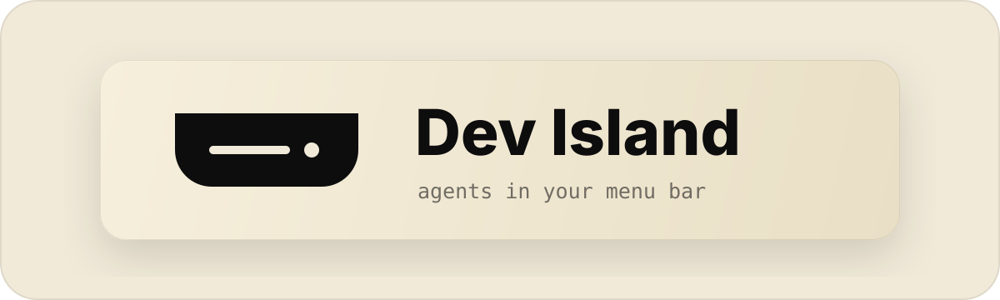

<p align="center">
  
</p>

<h1 align="center">Dev Island</h1>

<p align="center">
  <strong>Why pay for a closed-source app just to monitor your coding agents?</strong>
  <br>
  Open-source, local-first, native macOS companion for AI coding agents.
  <br><br>
  <a href="README.zh-CN.md">中文</a> | <strong>English</strong>
</p>

<p align="center">
  <a href="https://github.com/vincentlauriat/dev-island/releases/latest"></a>
  <a href="https://github.com/vincentlauriat/dev-island/stargazers"></a>
  <a href="LICENSE"></a>
</p>

<p align="center">
  <a href="https://github.com/vincentlauriat/dev-island/releases">Download</a> ·
  <a href="#quick-start">Quick Start</a> ·
  <a href="docs/roadmap.md">Roadmap</a> ·
  <a href="CONTRIBUTING.md">Contributing</a>
</p>

<p align="center">
  
</p>

---

> ### This is a fork
>
> Dev Island is a fork of **[Open Island](https://github.com/Octane0411/open-vibe-island)** by
> [@Octane0411](https://github.com/Octane0411) and its contributors. All the engineering below is
> theirs; this fork renames the product and carries its own release identity so both apps can be
> installed side by side.
>
> Licensed **GPL v3**, like upstream. Bug reports about behaviour that also exists upstream belong
> [there](https://github.com/Octane0411/open-vibe-island/issues), not here.
>
> Syncing from upstream: see [`docs/fork-sync.md`](docs/fork-sync.md).

## What is Dev Island?

Dev Island sits in your Mac's **notch** (or top bar) and gives you a real-time control surface for your AI coding agents — session status, permission approvals, and instant jump-back to the right terminal. All without leaving your flow.

Think of it as an open-source [Vibe Island](https://vibeisland.app/) — **free, local-first, and you own every bit of it**.

> *You don't need to pay for a product you can vibe, since you are a vibe coder.*

## Why Dev Island?

- **Open source** — GPL v3, fork it, mod it, ship your own version
- **Local-first** — No server, no telemetry, no account. Everything runs on your Mac
- **Native macOS** — SwiftUI + AppKit, not an Electron wrapper
- **Multi-agent** — One surface for Claude Code, Codex, Cursor, Gemini CLI, OpenCode, and more
- **Multi-terminal** — Jump back to the exact terminal/IDE session in one click

## Supported Agents & Terminals

**10 agents**: Claude Code, Codex, Cursor, Gemini CLI, Kimi CLI, OpenCode, Qoder, Qwen Code, Factory, CodeBuddy

**15+ terminals & IDEs**: Terminal.app, Ghostty, iTerm2, WezTerm, Zellij, tmux, cmux, Kaku, VS Code, Cursor, Windsurf, Trae, JetBrains IDEs (IDEA, WebStorm, PyCharm, GoLand, CLion, RubyMine, PhpStorm, Rider, RustRover)

<details>
<summary>Full compatibility table</summary>

### Code Agents

| Agent | Status | Description |
|---|---|---|
| **Claude Code** | Supported | Hook integration, JSONL session discovery, status line bridge, usage tracking |
| **Claude Code (Desktop App)** | Supported | Same hooks as the CLI. Claude Desktop runs Claude Code as a TTY-less subprocess invisible to process discovery, so liveness follows the running desktop app (like Codex.app); jump-back activates Claude. Usage panel is account-wide but seeded by the CLI status line — see note below |
| **Codex** (CLI) | Supported | Hook integration (SessionStart, UserPromptSubmit, Stop by default; PreToolUse/PostToolUse parseable but not default), usage tracking |
| **Codex Desktop App** | Supported | Hook integration + app-server JSON-RPC connection for real-time thread/turn lifecycle. Precise conversation jump via `codex://threads/<id>` deep-link |
| **OpenCode** | Supported | JS plugin integration, permission/question flows, process detection |
| **Qoder** | Supported | Claude Code fork — same hook format, config at `~/.qoder/settings.json` |
| **Qwen Code** | Supported | Claude Code fork — same hook format, config at `~/.qwen/settings.json` |
| **Factory** | Supported | Claude Code fork — same hook format, config at `~/.factory/settings.json` |
| **CodeBuddy** | Supported | Claude Code fork — same hook format, config at `~/.codebuddy/settings.json` |
| **Cursor** | Supported | Hook integration via `~/.cursor/hooks.json`, session tracking, workspace jump-back |
| **Gemini CLI** | Supported | Hook integration via `~/.gemini/settings.json`, session tracking, fire-and-forget events |
| **Kimi CLI** | Supported | Hook integration via `~/.kimi/config.toml` `[[hooks]]`, session tracking, permission flow (reuses Claude payload) |

### Terminals & IDEs

| Terminal / IDE | Support Level | Description |
|---|---|---|
| **Terminal.app** | Full | Jump-back with TTY targeting |
| **Ghostty** | Full | Jump-back with ID matching |
| **cmux** | Full | Jump-back via Unix socket API |
| **Kaku** | Full | Jump-back via CLI pane targeting |
| **WezTerm** | Full | Jump-back via CLI pane targeting |
| **iTerm2** | Full | Jump-back with session ID / TTY matching |
| **tmux** (multiplexer) | Full | Jump-back with session/window/pane targeting |
| **Zellij** | Full | Jump-back via CLI pane/tab targeting |
| **VS Code** | Workspace | Activate workspace via `code` CLI |
| **Cursor** | Workspace | Activate workspace via `cursor` CLI |
| **Windsurf** | Workspace | Activate workspace via `windsurf` CLI |
| **Trae** | Workspace | Activate workspace via `trae` CLI |
| **JetBrains IDEs** | Workspace | IDEA, WebStorm, PyCharm, GoLand, CLion, RubyMine, PhpStorm, Rider, RustRover |
| **Warp** | Full | Precision tab jump via SQLite pane lookup + AX menu click |

### Other Features

| Feature | Description |
|---|---|
| Notch / top-bar overlay | Notch area on notch Macs, top-center bar on others |
| Settings | Hook install/uninstall, usage dashboard |
| Notification mode | Auto-height panel for permission requests and session events |
| Notification sounds | Configurable system sounds, mute toggle |
| i18n | English, Simplified Chinese |
| Session discovery | Auto-discover from local transcripts, persist across launches |
| Auto-update | Sparkle-based automatic updates |
| Signed & notarized | DMG packaging with Apple notarization |

</details>

## Quick Start

### Option 1: Download

Grab the latest DMG from [GitHub Releases](https://github.com/vincentlauriat/dev-island/releases) — signed and notarized, ready to run.

> No release has been cut from this fork yet. Until then, build from source.

### Option 2: Build from source

```bash
git clone https://github.com/vincentlauriat/dev-island.git
cd dev-island
open Package.swift   # Opens in Xcode — hit Run
```

On first launch, Dev Island auto-discovers your active agent sessions and starts the live bridge. Hook installation is managed from the **Settings** window inside the app.

> **Requirements**: macOS 14+, Swift 6.2, Xcode

## How It Works

```
Agent (Claude Code / Codex / Cursor / ...)
  ↓ hook event
DevIslandHooks CLI (stdin → Unix socket)
  ↓ JSON envelope
BridgeServer (in-app)
  ↓ state update
Notch overlay UI ← you see it here
  ↓ click
Jump back → correct terminal / IDE
```

Hooks **fail open** — if Dev Island isn't running, your agents continue unaffected.

<details>
<summary>Architecture details</summary>

Four targets in one Swift package:

| Target | Role |
|---|---|
| **DevIslandApp** | SwiftUI + AppKit shell — menu bar, overlay panel, settings |
| **DevIslandCore** | Shared library — models, bridge transport (Unix socket IPC), hooks, session persistence |
| **DevIslandHooks** | Lightweight CLI invoked by agent hooks, forwards payloads via Unix socket |
| **DevIslandSetup** | Installer CLI for managing `~/.codex/config.toml` and hook entries |

See [docs/architecture.md](docs/architecture.md) for the full system design.

</details>

## Community

This fork has no community channels of its own. The upstream project runs a
[Discord](https://discord.gg/bPF2HpbCFb) and a WeChat group — that is where the people who wrote
this code are, and where questions about how it works are best asked.

Issues and pull requests specific to *this fork* are welcome here. See
[CONTRIBUTING.md](CONTRIBUTING.md).

## Report a Bug via Your Code Agent

Copy this prompt into your agent (Claude Code, Codex, etc.) to auto-generate a well-structured issue:

<details>
<summary>Click to expand</summary>

```
I'm having an issue with Dev Island (https://github.com/vincentlauriat/dev-island).

Please help me file a GitHub issue. Do the following:

1. Collect my environment info:
   - Run `sw_vers` to get macOS version
   - Run `swift --version` to get Swift version
   - Check if Dev Island is running: `ps aux | grep -i "dev.island\|DevIslandApp" | grep -v grep`
   - Get the app version: `defaults read ~/Applications/Dev\ Island\ Dev.app/Contents/Info.plist CFBundleShortVersionString 2>/dev/null || echo "unknown"`
   - Check which terminal I'm using

2. Ask me to describe:
   - What I expected to happen
   - What actually happened
   - Steps to reproduce

3. Create the issue on GitHub using `gh issue create` with this format:
   - Title: concise summary
   - Body with sections: **Environment**, **Description**, **Steps to Reproduce**, **Expected vs Actual Behavior**
   - Add label "bug" if applicable

Repository: vincentlauriat/dev-island
```

</details>

## Contributors

Everything here was built by the
[Open Island contributors](https://github.com/Octane0411/open-vibe-island/graphs/contributors).

<a href="https://github.com/Octane0411/open-vibe-island/graphs/contributors">
  
</a>

---

## Agent Parts

This section is written for agents.

The open-source macOS companion for terminal-native AI coding.

`Dev Island` puts a lightweight control surface in your notch or top bar so you can keep an eye on live coding agents, follow session progress, and jump back to the right terminal without breaking flow.

### Why This Product Exists

AI coding is becoming part of the daily development loop, but the surrounding control layer still too often means handing your machine over to a closed-source paid app.

`Dev Island` takes the opposite approach:

- Open source
- Local first, no server dependency
- Native macOS (SwiftUI + AppKit)
- Built to support the terminal workflow, not replace it

### Who It Is For

Developers who already live in the terminal and want a better way to work with coding agents on macOS without losing context.

### Agent Integrations

- **Codex CLI** — Hook-based integration. The Codex CLI managed installer installs `SessionStart`, `UserPromptSubmit`, and `Stop` by default to keep the terminal workflow low-noise. Dev Island can parse richer Codex hook events such as `PreToolUse` and `PostToolUse` when configured manually, but those events are not part of the default managed installation. Codex file edits may use internal apply-patch paths, so file-edit approval should not be treated as guaranteed `PreToolUse` coverage. Reads 5-hour and 7-day account usage windows from local rollout files. Install/uninstall managed hooks from the Settings window or CLI.
- **Codex Desktop App** — Detected via `__CFBundleIdentifier`; hook sessions tagged as `isCodexAppSession` so they follow desktop-app liveness (tied to `NSWorkspace.shared.runningApplications` rather than the CLI subprocess that exits after each turn). In addition to hooks, Dev Island launches its own `codex app-server` subprocess and speaks JSON-RPC over stdio to receive live `thread/started`, `turn/started`, `turn/completed`, and `thread/closed` notifications. Clicking a session opens the exact conversation via the `codex://threads/<id>` URL scheme.
- **Claude Code** — Hook-based integration via `~/.claude/settings.json`. Discovers sessions from `~/.claude/projects/` JSONL transcripts. Persists and restores sessions across app launches. Managed status line bridge with opt-in installation. Reads cached 5-hour and 7-day usage windows.
- **Claude Code (Desktop App)** — The Claude desktop app runs Claude Code in its "local agent mode" as a TTY-less subprocess that `ps`/`lsof` process discovery cannot see. Detected via `CLAUDE_CODE_ENTRYPOINT=claude-desktop` (with `__CFBundleIdentifier=com.anthropic.claudefordesktop` as a fallback) and tagged with a `Claude.app` jump target so liveness follows the running desktop app (`NSWorkspace.shared.runningApplications`) instead of the missing terminal process. Without this, the hook-managed liveness fallback evicted the session ~6 seconds after it appeared ([#510](https://github.com/vincentlauriat/dev-island/issues/510)). Clicking a session activates Claude. **Usage caveat:** the 5h/7d usage panel is fed by Claude Code's terminal status line, which Claude Desktop's headless `stream-json` mode never renders — so Desktop sessions do not update it on their own, and Claude does not persist the rate-limit windows to a readable file. Because the limits are account-wide, running an interactive `claude` in a terminal occasionally seeds the cache and the panel then reflects total usage (including what Desktop consumed). Native Desktop usage (without a CLI session) needs a separate data source and is tracked as a follow-up.
- **OpenCode** — JS plugin integration via `~/.config/opencode/plugins/`. Plugin auto-installed on first launch. Receives session lifecycle, tool use, permission, and question events. Permission approval and question answering flows supported. Process detection via `ps`.
- **Qoder** — Claude Code fork. Same hook format and events via `~/.qoder/settings.json`. Use `--source qoder` with the hooks binary.
- **Qwen Code** — Claude Code fork. Same hook format and events via `~/.qwen/settings.json`. Use `--source qwen` with the hooks binary.
- **Factory** — Claude Code fork. Same hook format and events via `~/.factory/settings.json`. Use `--source factory` with the hooks binary.
- **CodeBuddy** — Claude Code fork. Same hook format and events via `~/.codebuddy/settings.json`. Use `--source codebuddy` with the hooks binary.
- **Cursor** — Hook-based integration via `~/.cursor/hooks.json`. Receives `beforeSubmitPrompt`, `beforeShellExecution`, `beforeMCPExecution`, `beforeReadFile`, `afterFileEdit`, and `stop` events. Session persistence across app launches. Workspace jump-back via `cursor -r`. Use `--source cursor` with the hooks binary.
- **Gemini CLI** — Hook-based integration via `~/.gemini/settings.json`. Receives `SessionStart`, `PreToolUse`, `PostToolUse`, `Stop`, and `UserPromptSubmit` events. Fire-and-forget (no block/deny). Use `--source gemini` with the hooks binary.
- **Kimi CLI** — Hook-based integration via `~/.kimi/config.toml` `[[hooks]]` array (Moonshot AI). Kimi's hook payload is byte-compatible with Claude Code, so Dev Island reuses the Claude decode path and adds a dedicated TOML installer. Subscribes to `SessionStart`, `UserPromptSubmit`, `Stop`, `Notification`, `PreToolUse`, and `PostToolUse`. Requires the Kimi CLI Hooks Beta. Use `--source kimi` with the hooks binary. Manage installation from the Settings window, or via CLI:

  ```sh
  swift run DevIslandSetup installKimi    # write [[hooks]] entries into ~/.kimi/config.toml
  swift run DevIslandSetup statusKimi     # report whether managed hooks are present
  swift run DevIslandSetup uninstallKimi  # remove managed entries, preserve user-authored [[hooks]]
  ```

### Terminal Support

- **Terminal.app**, **Ghostty**, **cmux**, **Kaku**, **WezTerm**, **iTerm2**, and **Zellij** — Full jump-back support with session attachment matching (cmux via Unix socket API, Kaku/WezTerm/Zellij via CLI pane targeting, iTerm2 via AppleScript session/TTY probe)
- **VS Code**, **VS Code Insiders**, **Cursor**, **Windsurf**, **Trae** — Workspace-level jump via respective CLI (`code -r`, `cursor -r`, etc.)
- **JetBrains IDEs** (IntelliJ IDEA, WebStorm, PyCharm, GoLand, CLion, RubyMine, PhpStorm, Rider, RustRover) — Workspace-level jump via IDE CLI launcher
- **Warp** — Precision tab jump via SQLite pane lookup, pid-based sibling-tab disambiguation, and AX menu click

### UI & Display

- **Notch overlay** — On Macs with a built-in notch, the island sits in the notch area; on external displays or non-notch Macs, it falls back to a compact top-center bar
- **Settings** — Hook install/uninstall, Codex/Claude usage dashboard, General, Display, Sound, Shortcuts, Lab (advanced), About
- **Notification mode** — Auto-height notification panel for permission requests and session events
- **Notification sounds** — Configurable system sounds (default: Bottle) with mute toggle
- **i18n** — English and Simplified Chinese

### Session Management

- Live session visibility with expandable detail rows
- Session state reducer (`SessionState.apply`) as single source of truth
- Automatic session discovery from local transcript files and cache
- Process discovery via `ps`/`lsof` for active agent matching

### Architecture

Four targets in one Swift package:

| Target | Role |
|---|---|
| **DevIslandApp** | SwiftUI + AppKit shell — menu bar, overlay panel, settings |
| **DevIslandCore** | Shared library — models, bridge transport (Unix socket IPC), hooks, session persistence |
| **DevIslandHooks** | Lightweight CLI invoked by agent hooks, forwards payloads via Unix socket |
| **DevIslandSetup** | Installer CLI for managing `~/.codex/config.toml` and hook entries |

### Quick Start (Agent)

Build and run locally:

```bash
open Package.swift
```

Build a local `.app` bundle:

```bash
zsh scripts/package-app.sh
```

That script creates `output/package/Dev Island.app` and `output/package/Dev Island.zip`. Pass `DEV_ISLAND_SIGN_IDENTITY` to sign the bundle. See [docs/packaging.md](docs/packaging.md) for the full path, including notarization.

#### Connect Codex

Open the package in Xcode to run the macOS app target. On launch, the app restores its local cache, scans recent `~/.codex/sessions/**/rollout-*.jsonl` files for existing Codex sessions, and starts the live bridge for new hook events.

The Settings window shows live Codex hook install status from `~/.codex`, and can install or uninstall managed hook entries directly. Installs copy the helper into `~/Library/Application Support/DevIsland/bin/DevIslandHooks` so repo renames do not break existing hooks.

```bash
swift build -c release --product DevIslandHooks
swift run DevIslandSetup install
swift run DevIslandSetup status
swift run DevIslandSetup uninstall
```

#### Connect Claude Code

Claude usage setup is available from the app's Settings window and remains opt-in. The bridge writes a managed `statusLine.command` to `~/.dev-island/bin/dev-island-statusline`, caches `rate_limits` into `/tmp/dev-island-rl.json`, and refuses to overwrite an existing custom status line automatically.

### Repository Map

- Start with [docs/index.md](docs/index.md) for the current doc map.
- Read [docs/quality.md](docs/quality.md) for the quality baseline and verification approach.
- Read [docs/hooks.md](docs/hooks.md) for all supported hook events, payload fields, and directive response formats.
- Run `scripts/harness.sh` for automated checks (docs validation, tests, build).

### Requirements

- macOS 14+
- Swift 6.2
- Xcode (for the app target)

---

## License

[GPL v3](LICENSE)
